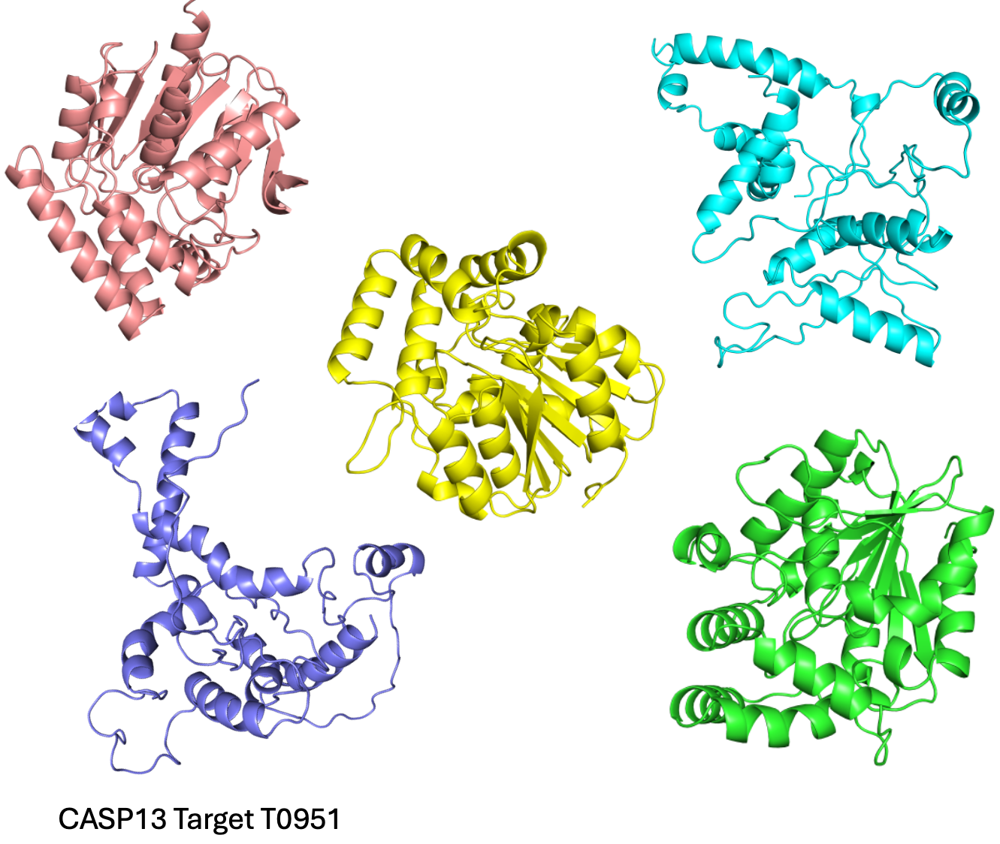
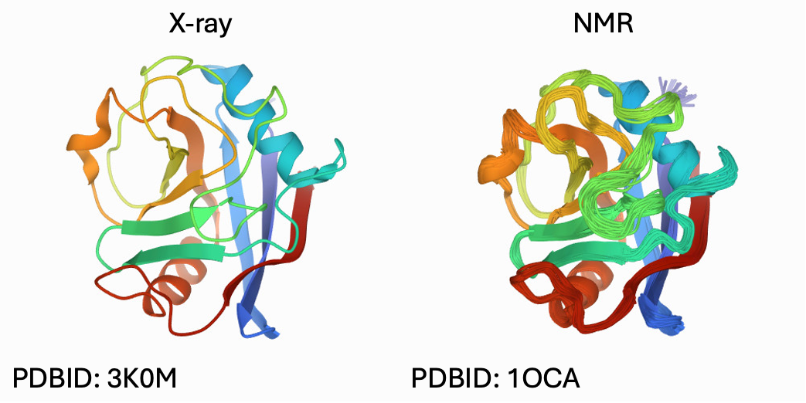

<html lang="en">
<head>
    <meta charset="UTF-8">
    <meta name="viewport" content="width=device-width, initial-scale=1.0">
    <title>Title Block Example</title>
    
</head>

I am currently a postdocoral researcher working with Lisa Manning in the Syracuse University Physics Department. I received my Ph.D. in Computational Biology and Bioinformatics in 2024 from Yale University advised by Corey O'Hern. I recevied my B.S. in Biochemistry and molecular biology and B.A. in Philosophy from the Pennsylvania State University in 2018.   

How can we apply approaches from soft matter physics to better understand protein structure and folding? My PhD study comes in two parts: First, applying careful analysis of the features of protein core packing to quantify the quality of protein structural models. Second, bringing concepts from glass and jamming literature to better understand the protein folding process.   
​
As a researcher, I seek to develop insightful, key features to quantify, understand and design not only proteins but also other complex disordered materials.   

  Protein Decoy Detection:

  

Given a set of predictions of the 3D structure of a protein, how do we select the most accurate prediction without knowing the right answer? If you have AlphaFold2, RosettaFold and ESMFold predictions that all disagree, which one should you trust and why?   

We demonstrate how high quality x-ray crystal structures have a few key features that describe the packing of the solvent inaccessible core. A predicted structure that has a reasonably sized interior with the expected density is likely to be a high quality prediction! ​ Read more: https://doi.org/10.1002/pro.3914   

  X-ray vs NMR Protein Core Packing:

X-ray crystallography is the standard method for solving a protein's structure at atomic scale with a clear measure of resolution. There have long been concerns that the crystalline environment and low temperatures leads to artifacts in the structure. NMR spectroscopy has been used to solve protein structures in-solution and at room temperature. However, more modeling steps are involved and there is no agreed upon metric of resolution.   

Fluctuations are known to increase density in packing studies, but temperature also generally increases the distance between attractive particles. Do both methods result in similar core regions?   

We carefully consider the quality of both x-ray crystal and NMR protein structures and find that high quality structures from both methods tend to produce cores of a similar size and density on average. This suggests that as far as core packing is concerned, the crystalline environment does not introduce significant artifacts. ​ Read more: https://doi.org/10.1002/pro.4373   

  The connection between polymer collapse and jamming:

  

The cores of proteins are quite dense, as dense as a jammed packing of amino-acid-shaped particles. But proteins fold due to attractive interactions; what does the thermal collapse of an attractive polymer have to do with a jammed packing of a repulsive polymer?   

We investigate the structural and mechanical properties of deeply quenched polymers below the glass transition and find that they are remarkably similar to their repulsive jammed counter parts. ​ Read more: https://journals.aps.org/pre/abstract/10.1103/PhysRevE.109.034406   

  Protein folding as a jamming transition:

Why do all protein cores fold to such a consistent density? The current orthodox is that proteins fold to a global energy minimum in equilibrium, which suggests the core density is at a maximum.   

Preliminary results suggest that the density seen in experimental protein cores is actually the minimum density needed to be mechanically stable to compression. Further thermalization during the packing process leads to denser states. This suggests proteins might fold via a non-equilibrium process and may undergo aging dynamics in the folded state. ​ Read more: https://arxiv.org/abs/2405.09646   
